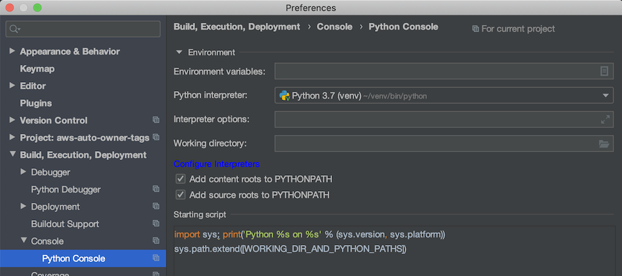

&nbsp;&nbsp;&nbsp;&nbsp;&nbsp;&nbsp;&nbsp;&nbsp;&nbsp;&nbsp;
&nbsp;&nbsp;&nbsp;&nbsp;&nbsp;&nbsp;&nbsp;&nbsp;&nbsp;

# AWS Auto Owner Tags

This Python Lambda project automates the tagging of AWS resources that are created inside AWS accounts, identifying who has created the resource by their AWS login. 

Common Tagging Strategies: tag name: **Creator** value: **IAM user name** or **root_account** or **AWS service**  

# Quick start

For first time usage, follow these steps to add auto tagging support:

```shell script
cd aws-auto-owner-tags
deploy-stacks.sh -a <aws_account> -r <region> -ac create-infra
deploy-stacks.sh -a <aws_profile> -r <region> -ac create-all-services
```

This will create CloudFormation stacks on the account and region used. Repeat for other accounts and regions. For a 
deeper dive ... keep reading.


# Deploying Auto Tagging
Use the `deploy-stacks.sh` script to manage CloudFormation stacks.

```shell script
Usage:
  deploy-stacks.sh [options]

  Initial setup, run deploy-stacks.sh with the create-infra action.

Options:

  --account or -a         :AWS account profile (see ~/.aws/credentials)
  --region or -r          :AWS region, default is us-east-1
  --action or -ac         :Action that you want to perform on the CloudFormation stack, actions:
                                  o create-infra
                                  o delete-infra
                                  o create-stack - also functions as update-stack
                                  o delete-stack
                                  o create-all-services
                                  o delete-all-services
  --awsservice or -as     :AWS service to perform action on, services:
                                  o rds
                                  o ec2
                                  o s3
                                  o dynamodb
                                  o redshift
```
## Setup Infrastructure

Auto tagging relies on two S3 buckets:

*  `auto-tag-cf-data` - Used by CloudFormation to store artifacts for Lambda deployment.
*  `auto-tag-log-data` - Used by CloudTrail to log events that trigger S3 object tagging.

To create the infrastructure, run `create-infra`.

```shell script
deploy-stacks.sh -a <aws_account> -r <region> -ac create-infra
```

## Create a stack

Stacks are auto-named base on the supported service types:

*  EC2 service - stack is named **AutoTag-ec2**
*  RDS service - stack is named **AutoTag-rds**
*  S3 service - stack is named **AutoTags-s3**
*  DynamoDB service - stack is named **AutoTags-dynamodb**
*  Redshift service - stack is name **AutoTags-redshift**

```shell script
cd aws-auto-owner-tags
./deploy-stacks.sh \
  -a <aws_profile> \
  -r <region> \
  -ac create-stack \
  -as <service_to_perform_action_on>
```

## Delete a stack

```shell script
cd aws-auto-owner-tags
./deploy-stacks.sh \
  -a <aws_profile> \
  -r <region> \
  -ac delete-stack \
  -as <service_to_perform_action_on>
```

## Create stacks for all services

```shell script
cd aws-auto-owner-tags
./deploy-stacks.sh \
  -a <aws_profile> \
  -r <region> \
  -ac create-all-services
```

## Delete stacks for all services

```shell script
cd aws-auto-owner-tags
./deploy-stacks.sh \
  -a <aws_profile> \
  -r <region> \
  -ac delete-all-services
```

# Architecture

The project is implemented with Lambda functions written in Python. Packaging and deployment is done with CloudFormation.
CloudTrail events trigger on resource creation, calling the Lambda functions for supported services:
*  EC2
*  RDS
*  S3
*  DynamoDB
*  Redshift

## Lambda functions

### ec2_function.py
Adds Creator tag to EC2 instances, EBS volumes, EBS Snapshots or AMIs. Events:
*  CreateVolume
*  RunInstances
*  StartInstances
*  RebootInstances
*  CreateImage
*  CreateSnapshot

### rds_function.py
Adds Creator tag to RDS resources when any of the following events happen:
*  CreateDBClusterSnapshot
*  CreateDBInstance
*  CreateDBSnapshot
*  CreateDBParameterGroup
*  CreateDBSubnetGroup
*  CreateOptionGroup.

### s3_function.py

Adds Creator tag to S3 resources when any of the following events happen:
*  CreateBucket
*  PutObject

### dynamodb_function.py

Adds Creator tag to DynamoDB tables and DAX clusters, driven by these events:
*  CreateTable
*  CreateCluster

### redshift_function.py

Process and summarize CloudWatch event, start Step Function state machine, passing event.
Events monitored:
*  CreateCluster

### redshift_sfn_function.py

Invoked by Step Function state machine at intervals until the cluster has been successfully tagged or max tries have been exhausted.

### Adding a new service

To add a new service create the following:

*  `<service_name>_sam.yaml` - create the SAM (can be pure CloudFormation) template to setup the CF stack.
*  `deploy-stacks.sh` - update the script to support the new service.
*  `lambda/<service_name>_function.py` - the Lambda handler code
*  `lambda/test_<service_name>_lambda_event.py` - test code, note that `local-aws-response` JSON is generated by 
[Placebo](https://placebo.readthedocs.io/en/latest/). Add the argument `mode='record'` to the 
`attach_local_aws_response` and run the test. The response JSON is written to the directory you add in `local-aws-response`.
*  `test_event_data/<service_name>_<operation>.json` - add the `event.detail` JSON. You can get this by finding event
format for the service in the AWS docs or generate a notification and Lambda run by adding a resource. Print the event
and copy it from the CloudWatch logs.
*  `Makefile` - add the new build directory and zip command
*  `README.md`

# Code and Environment

## Python Style Guide

The project conforms to the [PEP 8 Style Guide](https://www.python.org/dev/peps/pep-0008/).

## Environment Setup

In PyCharm, right click the `lambda` folder and mark as **Sources Root** to have your imports/from directives not complain about "resource not found".

### Python3 virtualenv

Add a Python3 virtual environment to use in your IDE:

```shell script
brew install python3
pip3 install virtualenv
virtualenv -p python3 ~/venv
```

If there is an old `venv`, you may need to delete it first. There is a symbolic link that points to a specific `homebrew` install. For example:
```shell script
.Python -> /usr/local/Cellar/python/3.7.5/Frameworks/Python.framework/Versions/3.7/Python
```
If the Cellar version doesn't match the Python Console can't find `.Python`

Update the Python interpreter in PyCharm preferences...



### Linting

Add [pylint](https://pypi.org/project/pylint/). See the [User Manual](http://pylint.pycqa.org/en/latest/) for more details.

```shell script
cd <to your venv bin>
./pip3 install pylint
```

Lint code manually during development:

```shell script
cd aws-auto-owner-tags/lambda
pylint --rcfile ../.pylintrc *.py
```

### AWS SDK for Python (Boto 3)

Reference [SDK Python](https://aws.amazon.com/sdk-for-python/) and [Boto 3 Docs](https://boto3.amazonaws.com/v1/documentation/api/latest/index.html).

```shell script
cd <to your venv bin>
./pip3 install boto3
```

### Placebo

[Placebo](https://placebo.readthedocs.io/en/latest/) is a tool used to mock external API's.

```shell script
cd <to your venv bin>
./pip3 install placebo
./pip3 install httmock
```

## SAM

To use the SAM CLI, you need the following tools.

* AWS CLI - [Install the AWS CLI](https://docs.aws.amazon.com/cli/latest/userguide/cli-chap-install.html) and [configure it with your AWS credentials].
* SAM CLI - [Install the SAM CLI](https://docs.aws.amazon.com/serverless-application-model/latest/developerguide/serverless-sam-cli-install.html)

### Template validation

Validate a SAM template file:

```shell script
sam validate --template-file=<SAM_template>.yaml
```

### Package and Deploy

CloudFormation can be used to package and deploy, but SAM CLI can also be used. It is a wrapper around CloudFormation.
For example to package and deploy the EC2 auto tagging (replace `profile` to your intended target):

Package:

```shell script
sam package \
  --template-file ec2_sam.yaml \
  --output-template-file ec2_sam_package.yaml \
  --s3-bucket <BUCKETNAME> \
  --profile <PROFILE>
```

Deploy:

```shell script
sam deploy \
  --template-file ec2_sam_package.yaml \
  --stack-name AutoTag-ec2 \
  --capabilities CAPABILITY_IAM \
  --profile <PROFILE>
```

To update, just make changes and then re-run the `sam package` and `sam deploy` commands.

Delete:

```shell script
aws cloudformation delete-stack \
  --stack-name <STACKNAME> \
  --region <REGION> \
  --profile <PROFILE>
```
